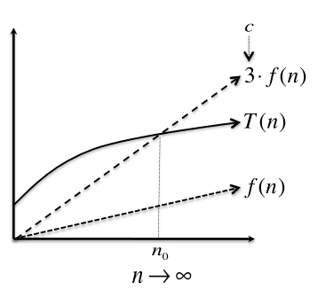
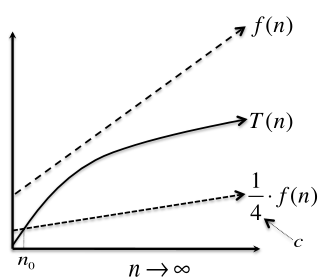
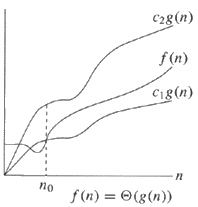
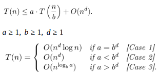

# Algorithms & Data Structures

## I. Time Complexity

### Asymptotic Notation
Idea: Suppress constant factors and lower-order terms

|Big O - O(…)|Big Omega - Ω(…)|Big Theta - Θ(…)|
|----------|-------------|------|
|<ul><li>Upper bound</li><li>T(n) is O(f(n)) if f(n) grows at least as fast as T(n) as n gets large</li></ul> | <ul><li>Lower bound</li>T(n) is Ω(f(n)) if f(n) grows at most as fast as T(n) as n gets large</li></ul> | <ul><li>Lower and Upper bound</li><li>T(n) = O(f(n)) AND T(n) = Ω(f(n))</li></ul> |
||||

### Master Theorem

**Example** : Binary Search
- Recurses on either the left half of the input array or the right half.
- One recursive call, `a=1`
- The recursive call is on half of the input array, `b=2`
- Outside the recursive call, a single comparison between the middle element and the searched one. `O(1); d=0`
- Since `a = 1 = 20 = b^d` -> `O(n^d log n) = O(log n)`

## II. Sorting
### Insertion Sort
- ### Algorithm [View](sorting/insertion.go)
    - From i to 0..n, insert a[i] to its correct position to the left (0..i)

- ### Complexity
    | Time | Space |
    |---|---|
    | `O(n²)` | `O(1)` |

### Merge Sort
- ### Algorithm [View](sorting/mergesort.go)
    - Splits a collection into two halves
    - Sort the two halves (recursive call)
    - Merge them together to form one sorted collection

- ### Complexity
    | Time | Space |
    |---|---|
    | `Θ(n log n)` | `O(n)` |

### Quick Sort
- ### Algorithm [View](sorting/quicksort.go)
    - Choose a pivot element `p`
    - Partition array `A` around `p`
    - recursively sort first part of `A`
    - recursively sort second part of `A`

- ### Complexity
    | Time | Space |
    |---|---|
    | <ul><li>Best and average: `O(n log n)`</li><li>Worst: `O(n²)`</li> | `O(n log n)` |

## III. Data Structures
- They exist for organizing and manipulating data
- Different data structures support different set of operations
- The more operations a data structure supports, the slower the operations and greater the space overhead
- __Rule:__ Choose the simplest data structure that supports all the operations required by the problem

### Heap

- Data structure that keeps track of an evolving set of objects with keys and can quickly identify the object with the mininum of maximum key.
- In a max heap, the keys of parent nodes are always greater than or equal to those of the children and the highest key is in the root node.
- In a min heap, the keys of parent nodes are less than or equal to those of the children and the lowest key is in the root node

- ### Algorithm [View](datastructures/heap.go)
    - #### Insert
        - Stick the new object at the end of the heap and increment the heap size
        - Repeatedly swap the new object with its parent until the heap property is restored
    - #### ExtractMin
        - **Operation:** Given a heap `H`, remove and return from `H` an object with the smallest key
        - Overwrite the root with the last object `x` in the heap, and decrement the heap size
        - Repeatedly swap `x` with its smallest child until the heap property is restored

- ### Complexity
    |Operation|Running Time|
    |---|---|
    |Insert|`O(log n)`|
    |ExtractMin|`O(log n)`|
    |FindMin|`O(1)`|
    |Heapify|`O(n)`|
    |Delete|`O(log n)`|
    
### Binary Search Tree

- Data structure optimized for -wait for it- search. Compared to heap that optimizes fast minimum computations.
- Type of binary tree which maintains the property that the value in each node must be greater than or equal to any value stored in the left sub-tree, and less than or equal to any value stored in the right sub-tree

- ### Algorithm [View](datastructures/bst.go)
    - #### Insert
        - Start at the root node
        - Repeatedly traverses left and right child pointers, until a null pointer is encountered
        - Replace the null pointer with one to the new object. Set the new node's parent pointer to its parent, and child pointers to null
    - #### Delete
        - Use Search to locate an object `x` with key `k`. (If no such object exists, halt)
        - If `x` has no children, delete `x` by setting the appropriate child pointer of `x`'s parent to null. (If `x` was the root, the new tree is empty)
        - If `x` has one child, splice `x` out by rewiring the appropriate child pointer of `x`'s child to `x`'s parent. (If `x` was the root, its child becomes the new root)
        - Otherwise, swap `x` with the object in its left subtree that has the biggest key, and delete `x` from its new position (where it has at most one child).
    - #### Search
        - Start at the root node
        - Repeatedly traverses the left and right child pointers. Left if `k` is less than current node's key, right otherwise
        - Return a pointer to an object with key `k` or none
    - #### Min (Max)
        - Start at the root node
        - Traverse left (or right) child pointers until reaching a null pointer
        - Return the pointer of the last visited object
    - #### Predecessor
        - If `x`'s left subtree is non-empty, return the result of Max applied to this subtree.
        - Otherwise, traverse parent pointers upward toward the root. If the traversal visits consecutive nodes `y` and `z` with `y` a right child of `z`, return a pointer to `z`.
        - Otherwise, return none.
    
- ### Complexity
    |Operation|Running Time|
    |---|---|
    |Insert|`O(log n)`|
    |Delete|`O(log n)`|    
    |Min, Max|`O(log n)`| 
    |Predecessor|`O(log n)`|
    
### Hash Table

- Facilitates fast searches (lookups).
- Use it when a problem needs fast lookups with a dynamically changing set of objects.
- Implemented with array of linked list
- Hash code function give the array index
- Collision resolutions: Chaining, Open Addressing

- ### Algorithm [View](datastructures/hashtable.go)
    - The Table type is the basis of the package. It stores key/value string pairs using a slice internally, where the number of hashtable buckets within the slice is determined by an integer m:
    - A smaller m means less buckets will be created, but each key stored in the Table has a higher likelihood of having to share a bucket with other keys, thus slowing down lookups
    - A larger m means more buckets will be created, so each key stored in the Table has a lower likelihood of having to share a bucket with other keys, thus speeding up lookups
    - The kv type is a small helper to concisely store a key/value string pair.

- ### Complexity
    |Operation|Running Time|
    |---|---|
    |Insert|`O(1)`|
    |Lookup|`O(1)`|    
    |Delete|`O(1)`| 

### Todo
- [ ] Black-Red Tree
- [ ] B-Tree
- [ ] AVL Tree
- [ ] Bloom Filter
- [ ] Queue
- [ ] Stack
- [ ] Linked List

## III. Graphs

- `G = (V, E)`; `m = |V|`; `n = |E|`
- Adjacency matrix is an efficient way to encode a dense graph but is wasteful for a sparse graph
- Adjacency matrix takes O(n²) space, whereaas adjacency list takes O(m + n) 
- Adjacency lists are perfect for graph exploration
- Why do we want to search a graph:
    - To check connectivity
    - Shortest path
    - Planning
    - Connected components
    
### Strongly Connected Components (SCC)

- A directed graph `G = (V, E)` is strongly connected if for all `v`,`w` in `V`: There's a path from `v` to `w` and from `w` to `v`
- We can decompose a graph into SCC. These tell you about "groups"

- ### Algorithm [View](/graphs/toposort.go)
    - Do DFS to create a DFS forest
        - Choose starting vertices in any order
        - Keep track of finishing times
    - Reverse all the edges in the graph
    - Do DFS again to create another DFS forest
        - This time, order the nodes in the reverse order of the finishing times that they had from the first DFS run
    - The SCCs are the different trees in **the second DFS forest**

- ### Complexity
    |Time|
    |---|
    |`O(m + n)`|

    
### Breadth-first search (BFS)

- It's a good way to find connected components
- Useful for testing if a graph is bipartite or not
- Only works with unweighted graphs

- ### Algorithm [View](graphs/bfs.go)
    - Explore the vertices of a graph in "layers". Explores the neighbor nodes first, before moving to the next level neighbors

- ### Complexity
    |Time|
    |---|
    |`O(m + n)`|

### Depth-first search (DFS)

DFS is a graph technique for searching exhaustively all the neighbors of each vertex that are connected. It goes deeply.

- ### Algorithm [View](graphs/dfs.go)
    - Traverse deep into the graph by visiting the children before sibling/neighbor nodes
    - Walk though a path, backtrack until we found a new path

- ### Complexity
    |Time|
    |---|
    |`O(m + n)`|

### Topological Sort

Is a linear ordering of a DAG' nodes such that from every node `u` to node `v`, `u` comes before `v` in the ordering

- ### Algorithm [View](graphs/toposort.go)
    - Same as DFS but maintain an array updading the visited elements in the first position as in a stack

- ### Complexity
    |Time|
    |---|
    |`O(m + n)`|
    
### Dijkstra's Algorithm

- Dijkstra is an algotihm that finds shortest paths in weightet graphs with non-negative edge weights
- The **cost** of a graph is the sum of the weights along that path
- The **shortest path** is the one with minimum cost
- Is very centralized: need to keep track of all the vertices to know which to update

- ### Algorithm [View](/graphs/dijkstra.go)
    - Init the shortest distance to MAX except for the initial node
    - Init a priority queue where the comparator will be on the total distance so far
    - Init a set to store all visited nodes
    - Add initial vertex to the priority queue
    - While queue is not empty: Mark vertex as visited, check the total distance to each neighbor, update shortest and previous arrays if smaller. If destination was unvisited, adds it to the queue

- ### Complexity
    |Time|
    |---|
    |`O(m + n log n)`|

### Bellman-Ford Algorithm

- Algorithm that solves the single source shortest paths problem on graphs with edges with potentially negative weights.
- Can be done in a distributed fashion, every vertex using only information from its neighbors

- ### Algorithm [View](/graphs/bellman-ford.go)
    - Given a directed graph and edges with weights
    - Detects a negative cycle if it exists and is reachable from s, or
    - Computes the shortest path distances

- ### Complexity
    |Time|
    |---|
    |`O(mn)`|

### Todo
- [ ] Floyd-Warshall Algorithm
- [ ] Prim's Algorithm
- [ ] Kruskal's Algorithm
