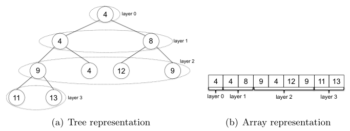

# Data Structures

- They exist for organizing and manipulating data
- Different data structures support different set of operations
- The more operations a data structure supports, the slower the operations and greater the space overhead
- __Rule:__ Choose the simplest data structure that supports all the operations required by the problem

### Heap

- Data structure that keeps track of an evolving set of objects with keys and can quickly identify the object with the mininum of maximum key.
- In a max heap, the keys of parent nodes are always greater than or equal to those of the children and the highest key is in the root node.
- In a min heap, the keys of parent nodes are less than or equal to those of the children and the lowest key is in the root node

- ### Algorithm [View](datastructures/heap.go)
  
  - #### Insert
    - Stick the new object at the end of the heap and increment the heap size
    - Repeatedly swap the new object with its parent until the heap property is restored
  - #### ExtractMin
    - **Operation:** Given a heap `H`, remove and return from `H` an object with the smallest key
    - Overwrite the root with the last object `x` in the heap, and decrement the heap size
    - Repeatedly swap `x` with its smallest child until the heap property is restored

- ### Complexity
  
  | Operation  | Running Time |
  | ---------- | ------------ |
  | Insert     | `O(log n)`   |
  | ExtractMin | `O(log n)`   |
  | FindMin    | `O(1)`       |
  | Heapify    | `O(n)`       |
  | Delete     | `O(log n)`   |

### Binary Search Tree

- Data structure optimized for -wait for it- search. Compared to heap that optimizes fast minimum computations.

- Type of binary tree which maintains the property that the value in each node must be greater than or equal to any value stored in the left sub-tree, and less than or equal to any value stored in the right sub-tree

- ### Algorithm [View](./bst.go)
  
  - #### Insert
    - Start at the root node
    - Repeatedly traverses left and right child pointers, until a null pointer is encountered
    - Replace the null pointer with one to the new object. Set the new node's parent pointer to its parent, and child pointers to null
  - #### Delete
    - Use Search to locate an object `x` with key `k`. (If no such object exists, halt)
    - If `x` has no children, delete `x` by setting the appropriate child pointer of `x`'s parent to null. (If `x` was the root, the new tree is empty)
    - If `x` has one child, splice `x` out by rewiring the appropriate child pointer of `x`'s child to `x`'s parent. (If `x` was the root, its child becomes the new root)
    - Otherwise, swap `x` with the object in its left subtree that has the biggest key, and delete `x` from its new position (where it has at most one child).
  - #### Search
    - Start at the root node
    - Repeatedly traverses the left and right child pointers. Left if `k` is less than current node's key, right otherwise
    - Return a pointer to an object with key `k` or none
  - #### Min (Max)
    - Start at the root node
    - Traverse left (or right) child pointers until reaching a null pointer
    - Return the pointer of the last visited object
  - #### Predecessor
    - If `x`'s left subtree is non-empty, return the result of Max applied to this subtree.
    - Otherwise, traverse parent pointers upward toward the root. If the traversal visits consecutive nodes `y` and `z` with `y` a right child of `z`, return a pointer to `z`.
    - Otherwise, return none.

- ### Complexity
  
  | Operation   | Running Time |
  | ----------- | ------------ |
  | Insert      | `O(log n)`   |
  | Delete      | `O(log n)`   |
  | Min, Max    | `O(log n)`   |
  | Predecessor | `O(log n)`   |

### Hash Table

- Facilitates fast searches (lookups).

- Use it when a problem needs fast lookups with a dynamically changing set of objects.

- Implemented with array of linked list

- Hash code function give the array index

- Collision resolutions: Chaining, Open Addressing

- ### Algorithm [View](datastructures/hashtable.go)
  
  - The Table type is the basis of the package. It stores key/value string pairs using a slice internally, where the number of hashtable buckets within the slice is determined by an integer m:
  - A smaller m means less buckets will be created, but each key stored in the Table has a higher likelihood of having to share a bucket with other keys, thus slowing down lookups
  - A larger m means more buckets will be created, so each key stored in the Table has a lower likelihood of having to share a bucket with other keys, thus speeding up lookups
  - The kv type is a small helper to concisely store a key/value string pair.

- ### Complexity
  
  | Operation | Running Time |
  | --------- | ------------ |
  | Insert    | `O(1)`       |
  | Lookup    | `O(1)`       |
  | Delete    | `O(1)`       |

### Todo

- [ ] Black-Red Tree
- [ ] B-Tree
- [ ] AVL Tree
- [ ] Bloom Filter
- [ ] Queue
- [ ] Stack
- [ ] Linked List
