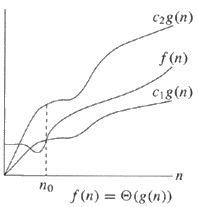

# Asymptotic Notation

Idea: Suppress constant factors and lower-order terms

| Big O - O(…)                                                                                                 | Big Omega - Ω(…)                                                                                        | Big Theta - Θ(…)                                                                  |
| ------------------------------------------------------------------------------------------------------------ | ------------------------------------------------------------------------------------------------------- | --------------------------------------------------------------------------------- |
| <ul><li>Upper bound</li><li>T(n) is O(f(n)) if f(n) grows at least as fast as T(n) as n gets large</li></ul> | <ul><li>Lower bound</li>T(n) is Ω(f(n)) if f(n) grows at most as fast as T(n) as n gets large</li></ul> | <ul><li>Lower and Upper bound</li><li>T(n) = O(f(n)) AND T(n) = Ω(f(n))</li></ul> |
|                                                                                      |                                                                             |                                                       |

### Master Theorem

**Example** : Binary Search

- Recurses on either the left half of the input array or the right half.
- One recursive call, `a=1`
- The recursive call is on half of the input array, `b=2`
- Outside the recursive call, a single comparison between the middle element and the searched one. `O(1); d=0`
- Since `a = 1 = 20 = b^d` -> `O(n^d log n) = O(log n)`

### Orders of grow

- Constant **O(1)**
  
  - Eg. Add two numbers

- Logarithmic **O(logN)**
  
  - Eg. Binary Search

- Linear **O(N)**
  
  - Eg. Find the maximum

- Linearithmic **O(NlogN)**
  
  - Eg. Mergesort, Quicksort

- Quadratic **O(N^2)**
  
  - Eg. Check all pairs

- Cubic **O(N^3)**
  
  - Eg. Check all triples

- Exponential **O(2^N)**
  
  - Eg. Check all subsets

**How to estimate a discrete sum?**

- Using discrete mathematics or just sum with integral and use calculus

**Complexity**

- **Upper Bound O(N):** Performance guarantee of algorithm of any input

- **Lower Bound Ω(N):** Proof that no algorithm can do better

- **Optimal Algorithm Θ(N):** Upper = Lower

**Algorithm Design**

- Develop an algorithm

- Prove a lower bound

**Steps to develop a usable algorithm**

- Model the problem

- Find an algorithm to solve it

- Fast enough? Fits in memory?
  
  - If not, figure out why now

- Find a way to address the problem

- Iterate until satisfied

**Comparing two algorithms**

- Implementing then and debugging them

- Analyzing their basic properties

- Formulating a hypothesis about comparative performance

- Running experiments to validate the hypothesis

### Big-O

- Big-O is a mean for describe how the number of operations required for an algorithm scales as the input grows in size. It tells how much time an algorithm will take as you increase the amount of data:
  
  - **N** usually indicate the size of dataset
  
  - If **O(N)** takes 1sec to operate on **N=1000**, expect to take **~5sec** on **N=5000**
  
  - If **O(N^2)** takes 1sec for operate on **N=1000**, expect to take **~25sec** on **N=5000**

### On Proofs

- **Theorems** are the most important technical statements

- **Lemma** is a technical statement that assists with the proof of the theorem
  
  - Eg. On divide and conquer merge sort, *merge* method is a lemma

- **Corollary** is a statement that follows inmediately from an already-proved result

- **Proposition** are stand-alone technical statements that are not particulary important in their own right

Proof or correctness by induction 4 steps:

- Base Case

- Inductive Hypothesis

- Inductive Step

- Conclusion

How do we show an algorithm is correct?: By proof (induction, contradiction, contrapositive, cases)

How do we measure the runtime of an algorithm?

- Worst-case analysis

- Asymptotic analysis

## **Asymptotic Analysis**

- Let **T(n), g(n) => T(n)** is **O(g(n))** if **g(n)** grows at least as fast as **T(n)** as n gets large

- For all c >= 0 and n >= n0

- Big O (Upper bound): 0 <= T(n) <= c.g(n)

- Big Ω (Lower bound): 0 <= c.g(n) <= T(n)

- Big Θ (Up and Low): T(n) = O(g(n)) && T(n) = Ω(g(n))

- implementation and analysis of normal and karatsuba multiplication and the insights of a divide and conquer approach to improve the efficiency of the algorithm

- asymptotic analysis: big o, big omega, big theta

- implementation and analysis of merge sort, divide and conquer approach

**Asymptotic analysis motivation**

- is important because it is the vocabulary for the design and analysis of algorithms (it's crucial)

- "sweet spot" for high level reasoning about algorithms

- coarse enough to supress architecture/programmin language/compiler

- sharp enough to make useful comparisons between algorithms, specially on large inputs

**what's the deal with asymptotic analysis anyways?**

the main point is to supress leading constant factors (too system dependent) and low order terms (irrelevant for large inputs)
